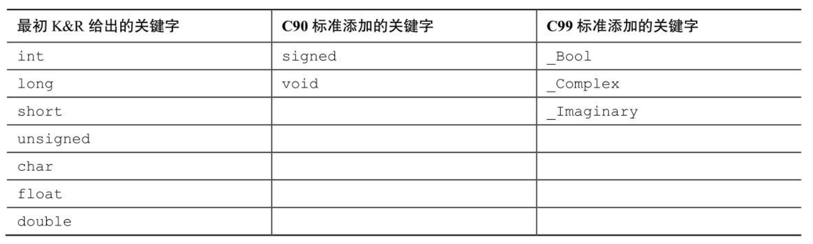

表3.1 C语言的数据类型关键字

_Bool类型表示布尔值（true或false），
_complex和_Imaginary分别表示复数和虚数

如果要在八进制和十六进制值前显示0和0x前缀，要分别在转换 说明中加入#。

在int 为16位、long为32位的系统中，会把7作为16位储存，把7L作为32位储存。l 或L后缀也可用于八进制和十六进制整数，如020L和0x10L

u或U后缀表示unsigned long long，如 5ull、10LLU、6LLU或9Ull。

在给函数传递参数时，C编译器把short类型的值自动转换成int类型的值

表3.2 转义序列

默认情况下，编译器假定浮点型常量是double类型的精度

通常，4.0和2.0被储存为64位的double类型，使用双精度进行乘法运算，然后将乘积截断成float类型的宽度

在浮点数后面加上f或F后缀可覆盖默认设置

（浮点数上溢）赋一个表示无穷大的特定值，而且printf()显示该值为inf或infinity

C编译器把浮点数转换成整数时，会直接丢弃（截断）小数部分

printf()语句把输出发送到一个叫作缓冲区（buffer）的中间存储区域

当缓冲区满、遇到换行字符或需要输入(或程序运行结束)的时候（从缓冲区把数据发送到屏幕或文件被 称为刷新缓冲区）
