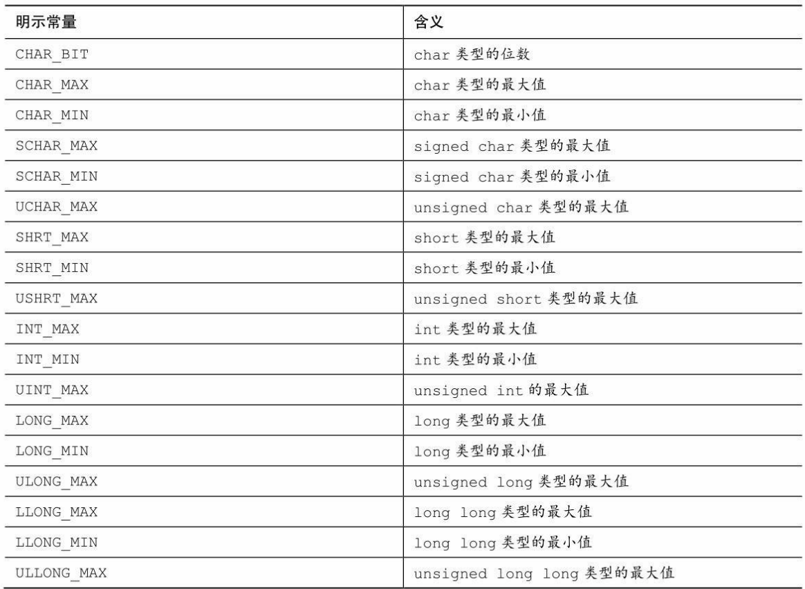
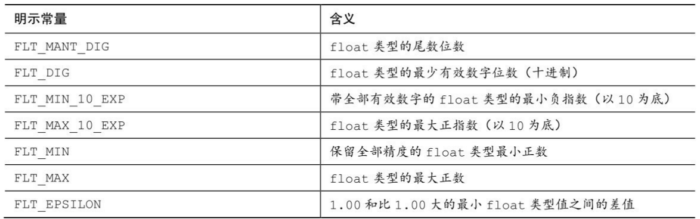
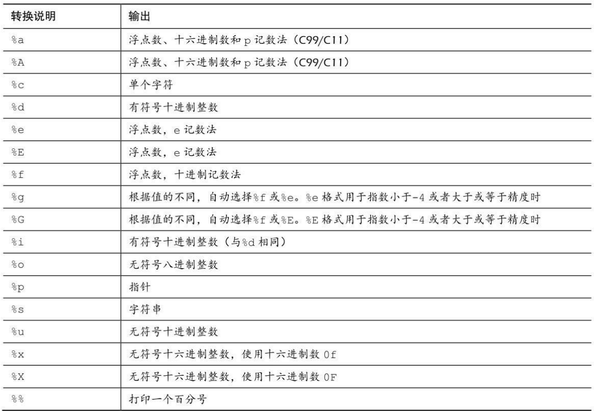

### 表4.1 limits.h中的一些明示常量

### 表4.2 float.h中的一些明示常量

### 表4.3 转换说明及其打印的输出结果

### 表4.4 printf()的修饰符

的修饰符.png)

### 表4.5 printf()中的标记

中的标记.png)

### 表4.6 ANSI C中scanf()的转换说明

的转换说明.png)

### 表4.7 scanf()转换说明中的修饰符

转换说明中的修饰符1.png)

转换说明中的修饰符2.png)
